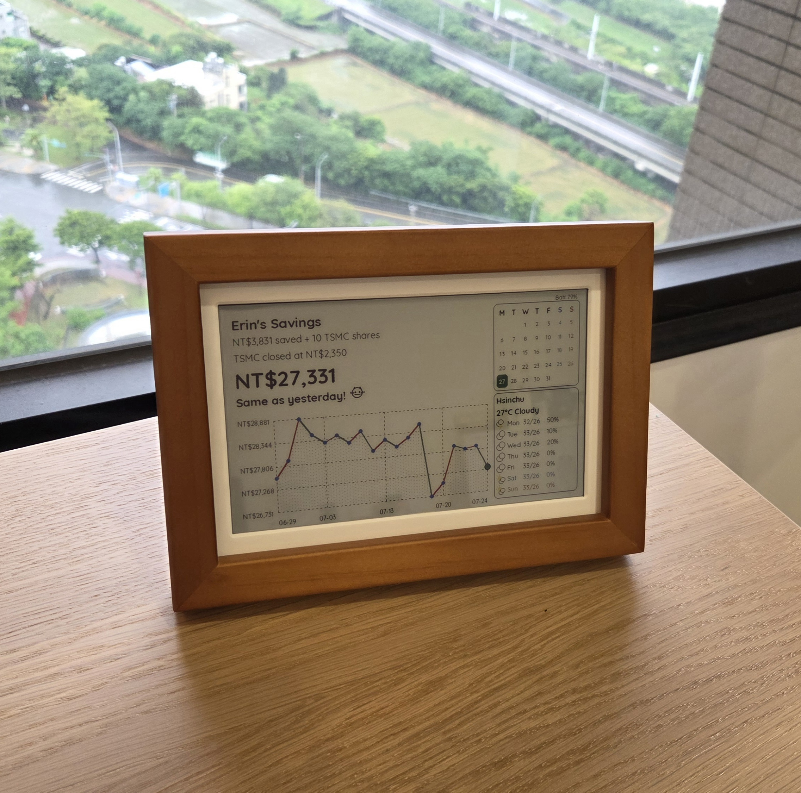

# StockCalendar



A battery-powered 7.3" e-paper calendar that also tracks the stock market
— built on Waveshare's
[RPi Zero PhotoPainter](https://www.waveshare.com/wiki/RPi_Zero_PhotoPainter)
(a Raspberry Pi Zero 2 W driving a 6-color ACeP display). Refreshes
automatically via cron, keeps time offline through an onboard RTC, and
degrades gracefully to cached data whenever any of its network sources are
unreachable.

## The story

This started with a simple idea: an 8-year-old girl, some pocket money, and
ten shares of TSMC. Rather than a bank statement she'd never read, why not
put her savings somewhere she'd actually look — a wooden photo frame on the
shelf, right next to the calendar she checks for school and the weather she
checks before deciding what to wear? A small hand-drawn cat that smiles
when her savings go up and frowns when they go down turned an abstract
number into something she could feel, with no percentages or candlestick
charts required.

But the shape of the idea is bigger than one stock, one currency, or one
kid. At its core, this project is really just: *read a few numbers you
care about, cache them safely, draw them somewhere calm and always-on, and
sip almost no power doing it.* That pattern reaches far past a stock
ticker:

- A grandparent's blood-pressure trend instead of a stock price, so family
  can check in without asking.
- A household's shared chore points, so nobody has to nag.
- A garden's soil moisture and next watering date, framed on a windowsill.
- A small shop's daily takings next to the till, no app or login required.
- A runner's weekly mileage building toward a race, beside the actual
  race-day calendar.
- A language-learner's streak, sitting somewhere they'll see it every
  morning.

None of these need a phone app, a subscription, or a screen competing for
attention — just a cheap e-paper panel, a battery, and a small computer
quietly doing the same three things this project does: fetch, cache, draw.
If there's a number in your life you wish you paid more attention to,
there's a good chance it belongs on a shelf like this one, not buried in
an app you forgot to open.

## What it shows

- **A savings tracker** — a fixed cash amount plus a stock holding, tracked
  as a combined value with an alternating chart (30-day history / today's
  intraday movement), a small hand-drawn mood-cat that reacts to the day's
  move, and plain-language status text instead of raw percentages.
- **A 7-day weather forecast** with hand-drawn condition icons, sourced
  from Taiwan's official CWA Open Data API.
- **A mini month calendar**, today highlighted.
- **A battery percentage readout**, read live from the onboard INA219 fuel
  gauge.

Everything is deliberately styled to be simple and readable at a glance —
a rounded font, soft card borders, and a calm color palette rather than a
dense data-heavy layout.

## Hardware

- Raspberry Pi Zero 2 W
- Waveshare 7.3" ACeP e-paper panel (800×480, 6 colors, no partial refresh)
- DS3231 RTC (offline timekeeping)
- INA219 fuel gauge (battery monitoring)
- Full board reference: [Waveshare RPi Zero PhotoPainter wiki](https://www.waveshare.com/wiki/RPi_Zero_PhotoPainter)

## Setup

You'll need your own:
- CWA Open Data API key (free registration at
  [opendata.cwa.gov.tw](https://opendata.cwa.gov.tw)) — save it to
  `cwa_api_key.txt` next to `dashboard.py` (this file is gitignored,
  never committed)
- A cron entry to run `dashboard.py` on your own schedule (see
  [SETUP.md](SETUP.md)'s "Cron / refresh cadence" section for the
  trading-hours-aware schedule this project actually uses)

Full setup log, architecture notes, and every design decision's rationale:
see **[SETUP.md](SETUP.md)**. Battery-life investigation and optimization
work: see **[BATTERY_OPTIMIZATION.md](BATTERY_OPTIMIZATION.md)**.

## Project layout

```
dashboard.py           # main entrypoint: fetch data, compose image, push to panel
stock_source.py        # live/intraday stock quote (TWSE + Yahoo Finance fallback)
stock_history.py       # ~30 trading days of daily closes
weather_source.py      # current + 7-day forecast (Taiwan CWA)
battery_source.py      # battery % via onboard INA219 fuel gauge
check_google_finance.py  # standalone on-demand price cross-check, not in the cron pipeline
test_display.py        # standalone hardware sanity check
lib/                   # Waveshare e-paper driver + INA219 vendor driver
```

This project is specific to the TSMC (2330.TW)/NT$/Taipei-trading-hours
use case it was originally built for, but the structure (a data source per
`*_source.py` module, each with its own graceful-degradation/caching, and
a single `dashboard.py` that composes and pushes the final image) should
adapt readily to a different stock, currency, or region.
